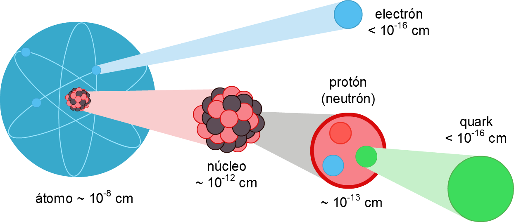
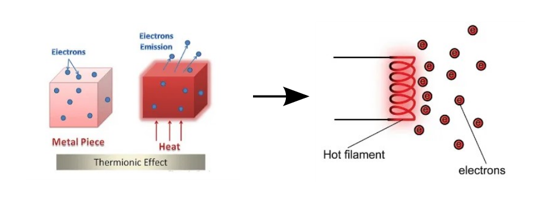
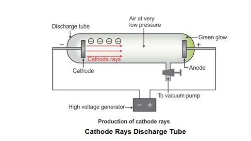

# Electronics

## What you will learn

By the end of this chapter, you should be able to:

-   explain thermionic emission
-   understand the mechanisms of cathode ray tube and cathode ray oscilloscope
-   specify the characteristics of cathode ray
-   understand the function of semiconductor diode
-   differentiate forward bias and reverse bias
-   read the figures of rectification of alternating current
-   know the purpose of a capacitor for smoothing
-   know the difference between npn and pnp transistors
-   draw and specify the mechanism of transistor circuit
-   understand the uses of transistor as current amplifier, automatic switch, light-controlled switch, heat-controlled switch

## Electron

All materials are composed of atoms (made up of nucleus and surrounded by electrons). At different shells, the electrons possess different energy level.

```{r atom-str, echo=FALSE, fig.cap="A atom is made up of nucleus in the center and surrounded by electrons", out.width='80%', fig.asp=.75, fig.align='center', fig.alt="A figure of an atoms with nucleus and surrounded by electrons"}



```

Source: [pngfind.com](https://www.pngfind.com/download/howwhTh_los-quarks-quarks-protones-neutrones-y-los-leptones/)

### Thermionic Emission

Thermionic emission is the emission of electrons from a heated metal with high level of thermal energy.

At room temperature, the energy processed by the electrons in the metal is insufficient for thermionic emission. When a metal is heated, the electrons gain thermal energy. The increase in thermal energy leads to the increase of kinetic energy.

Once sufficient thermal energy is supplied to the metal, the electrons gain enough energy to overcome the force of attraction between proton in the nucleus and electrons. Thus, the electrons escape to become free electrons.

```{r therm-emission, echo=FALSE, fig.cap="The electrons escape from the atom when they gained enough energy", out.width='80%', fig.asp=.75, fig.align='center', fig.alt="Two figures showed the electrons escaped the heated metal"}


```

Source: [electrical4u.com](https://www.electrical4u.com/thermionic-emission/)

There are **four** factors that affect the rate of thermionic emission. The *rate of emission* is the number of electrons emitted in 1 second.

-   **The temperature of the metal**

    -   As the temperature of the metal increases, the emission rate of electrons also increases.

-   **The total surface area of the metal**

    -   As the total surface area of the metal increases, the emission rate of electrons also increases.

-   **The type of metal**

    -   Different type of metals emits electrons at different rates.

-   **The coating on the surface of the metal**

    -   A layer coating of barium oxide (BaO) or strontium oxide(SrO) increases the rate of thermionic emission.

Here's a short video from Youtube about thermionic emission.

```{r therm-video, echo=FALSE, fig.cap= "A YouTube video by SPM Malaysia IPTV on thermionic emission"}

knitr::include_url("https://www.youtube.com/embed/QhG7u9PXG88", height = "400px")

```

### Cathode Ray

-   Cathode ray is a beam of negatively-charged electrons moving at high speed in vacuum tube.

-   The cathode ray is produced using extra high tension (E.H.T) as shown in the Figure below.

```{r cathode-ray-diff, echo=FALSE, fig.cap= "The electrons move from cathode to anode."}



```

Source: [topperlearning.com](https://www.topperlearning.com/answer/discovery-of-electron/w7idm3dd)

-   Inside the vacuum tube, there is one positive electrode called anode and one negative electode called cathode. (Note. Check the terminals of the E.H.T)

- When a high-voltage electric current is passed through the discharge tube containing a gas at a very low pressure, streams of electrons move at high speed in the vacuum tube.

- The hot cathode (connected to the negative terminal) continuously emits electrons towards the anode (connected to the positive terminal). 

- A green fluorescence is seen coming out of the other end of the discharge tube.

We can understand cathode ray using the **cathode ray oscilloscope**. Cathode ray oscilloscope (CRO)is made up of electron gun, deflection system, and fluorosecence screen. 

See the great video below by (alharony)(https://www.youtube.com/channel/UCuZUDL8-qH-loievrjAqXHg) on the structure of CRO.

```{r cro-video, echo=FALSE, fig.cap= "A YouTube video by alharony on cathode ray oscilloscope", fig.alt = "A video explanation on cathode ray oscilloscope"}
knitr::include_url("https://www.youtube.com/embed/U1amW7S1fcI", height = "400px")
```


```{block, type="info"}

**Additional Material**

You can explore how the electron gun is used to emit the electrons below. The experiment is more complicated than what you need to know for SPM but it is worth exploring for the curious mind. The awesome simulation is provided by [Ludwig-Maximilians-Universität München](https://virtuelle-experimente.de/en/index.php). 

In the first page, you will see the electron gun setup. You can click on the `info` icon for more information. 

If you click next, you should reach a page on the simulation (page 3). Play around with the heater voltage and acceleration voltage and observe how the emission of electron beams changes. 

The explanation is at the later pages. 

```

```{r add-gun, echo=FALSE, fig.cap="A complicated simulation of electron gun"}

knitr::include_url("https://virtuelle-experimente.de/en/kanone/klassisch/aufbau.php", height = "600px")

```


### Effects of Electrical Field and Magnetic Field on Cathode Rays

How do we prove that cathode ray is a negatively-charged beam? Let's conduct the experiment using the simulation by [The Concord Consortium](https://concord.org/). 

In this simulation, we are using Crookes Tube, which is a similar set-up to Thomson's experiment. It is through this experiment that Thomson discovered electron. 


```{block, type= "try"}
#### Effect of Electric Field on the Cathode Rays

**Aim:** To observe the effect of electric field on a cathode ray using a deflection tube. 

**Instruction:**

1. Turn on the voltage.

2. Change the electrode metal and observe.

3. Adjust the charge on horizontal plates and observe the change in direction.


**Observation:**
Based on your observations of the cathode rays, what you can determine about this stream of particles?

Did you realise that: 

- When the voltage off, there is no electron beam.

- When the high voltage is turned on, the cathode ray is moving in straight line when both plate have no charge.

- When the high voltage is turned on, the negatively-charged cathode ray deflect toward the positive plate and away from the negative plate. 

What are the reasons? 

- Each atom has a charged substructure consisting of a nucleus, which is made of protons and neutrons, surrounded by electrons.

- The phenomenon can be explained by the attraction and repulsion between electric charges at the atomic scale. 

**Conclusion:** The cathode ray can be deflected by electric field. 

```


```{r crookes, echo=FALSE}

knitr::include_app("https://lab.concord.org/embeddable.html#interactives/interactions/crookesElectrodes.json", height = "600px")

```


**How does electrons propagate in the absence of any electric or magnetic field?**

A Maltese Cross Tube (also known as Shadow Cross Tube) is used to answer this question. A electron gun produces an unfocused diverging beam which is detected by a fluorescent screen at the end of the evacuated tube. In the center of the bulb an aluminum cross is suspended. A high voltage is applied between the cathode (narrow end of the tube) and the anode (on the support, mid-way through the tube). The cross will obstruct the electron flow, creating a shadow on the fluorescent screen at the end of the tube.

```{block,  type ="info"}
#### Effect of Magnetic Field on the Cathode Rays

Aim: To observe the effect of magnetic field on cathode rays using a Maltese Cross Tube

When the power supply is switched on, a da


Source: [Harvard Natural Science Lecture Demonstrations] (https://sciencedemonstrations.fas.harvard.edu/presentations/maltese-cross-crt)

```

The characteristics of cathode ray include:

1.  Cathode ray is a negatively-charged electron beam.

2.  Cathode ray can be deflected by the electric field.

3.  cathode ray can be deflected by the magnetic field. The direction of deflection can be determined by the Fleming's Left-hand Rule.

4.  Cathode ray moves in a straight line and form a sharp shadow.

5.  Cathode ray moves at high speed (high kinetic energy).

6.  Cathode ray can produce a fluorescent effect when the electron beam hits the fluorescent screen.


### Electromagnetic Deflection in a Cathode Ray Tube

See what happens to the electron beams in the presence of a magnet

[electromagnetic deflection](https://nationalmaglab.org/education/magnet-academy/watch-play/interactive/electromagnetic-deflection-in-a-cathode-ray-tube-i)

<https://nationalmaglab.org/html5/MagLabU/includes/js/jquery.min.js>

## Semiconductor Diode

### Forward Biased vs. Reverse Biased

### Rectification

### Smoothing using capacitor

## Transistor

### NPN vs PNP transistor

### Structure of transistor circuit

### Use of transistor
