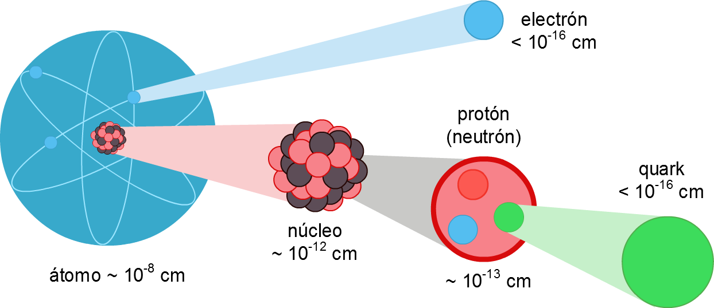
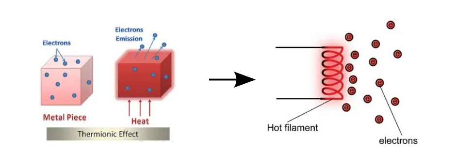

# Electronics

## What you will learn

By the end of this chapter, you should be able to:

-   explain thermionic emission
-   understand the mechanisms of cathode ray tube and cathode ray oscilloscope
-   specify the characteristics of cathode ray
-   understand the function of semiconductor diode
-   differentiate forward bias and reverse bias
-   read the figures of rectification of alternating current
-   know the purpose of a capacitor for smoothing
-   know the difference between npn and pnp transistors
-   draw and specify the mechanism of transistor circuit
-   understand the uses of transistor as current amplifier, automatic switch, light-controlled switch, heat-controlled switch

## Electron

All materials are composed of atoms (made up of nucleus and surrounded by electrons). At different shells, the electrons possess different energy level.

(\#fig:atom-str)A atom is made up of nucleus in the center and surrounded by electrons

Source: [pngfind.com](https://www.pngfind.com/download/howwhTh_los-quarks-quarks-protones-neutrones-y-los-leptones/)

### Thermionic Emission

Thermionic emission is the emission of electrons from a heated metal with high level of thermal energy.

At room temperature, the energy processed by the electrons in the metal is insufficient for thermionic emission. When a metal is heated, the electrons gain thermal energy. The increase in thermal energy leads to the increase of kinetic energy.

Once sufficient thermal energy is supplied to the metal, the electrons gain enough energy to overcome the force of attraction between proton in the nucleus and electrons. Thus, the electrons escape to become free electrons.

(\#fig:therm-emission)The electrons escape from the atom when they gained enough energy

Source: [electrical4u.com](https://www.electrical4u.com/thermionic-emission/)

There are **four** factors that affect the rate of thermionic emission. The *rate of emission* is the number of electrons emitted in 1 second.

-   **The temperature of the metal**

    -   As the temperature of the metal increases, the emission rate of electrons also increases.

-   **The total surface area of the metal**

    -   As the total surface area of the metal increases, the emission rate of electrons also increases.

-   **The type of metal**

    -   Different type of metals emits electrons at different rates.

-   **The coating on the surface of the metal**

    -   A layer coating of barium oxide (BaO) or strontium oxide(SrO) increases the rate of thermionic emission.

Here's a short video from Youtube about thermionic emission.

<iframe src="https://www.youtube.com/embed/QhG7u9PXG88" width="100%" height="400px"></iframe>

(\#fig:therm-video)A YouTube video by SPM Malaysia IPTV on thermionic emission

### Cathode Ray

-   Cathode ray is a beam of negatively-charged electrons moving at high speed in vacuum tube.

-   The cathode ray is produced using extra high tension (E.H.T) as shown in the Figure below.

(\#fig:cathode-ray-diff)In the first figure, the electrons move from cathode to anode

Source: [topperlearning.com](https://www.topperlearning.com/answer/discovery-of-electron/w7idm3dd)

-   Inside the vacuum tube, there is one positive electrode called anode and one negative electode called cathode. (Note. Check the terminals of the E.H.T)

- When a high-voltage electric current is passed through the discharge tube containing a gas at a very low pressure, streams of electrons move at high speed in the vacuum tube.

- The hot cathode (connected to the negative terminal) continuously emits electrons towards the anode (connected to the positive terminal). 

- A green fluorescence is seen coming out of the other end of the discharge tube.

We can understand cathode ray using the **cathode ray oscilloscope**. Cathode ray oscilloscope (CRO)is made up of electron gun, deflection system, and fluorosecence screen. 

See the great video below by (alharony)(https://www.youtube.com/channel/UCuZUDL8-qH-loievrjAqXHg) on the structure of CRO.

<iframe src="https://www.youtube.com/embed/U1amW7S1fcI" width="100%" height="400px"></iframe>

(\#fig:cro-video)A YouTube video by alharony on cathode ray oscilloscope

### Effects of Electrical Field and Magnetic Field on Cathode Rays

<h4 id="effect-of-electric-field-on-the-cathode-rays">Effect of Electric Field on the Cathode Rays</h4>

Aim: To observe the effect of electric field on a cathode ray using a deflection tube

<iframe width="1918px" height="967px" frameborder="no" scrolling="no" allowfullscreen="true" webkitallowfullscreen="true" mozallowfullscreen="true" src="https://lab.concord.org/embeddable.html#interactives/interactions/crookesElectrodes.json">
</iframe>

<h4 id="effect-of-magnetic-field-on-the-cathode-rays">Effect of Magnetic Field on the Cathode Rays</h4>

Aim: To observe the effect of magnetic field on cathode rays using a Maltese Cross Tube

When the power supply is switched on, a da

Source: [Harvard Natural Science Lecture Demonstrations] (<a href="https://sciencedemonstrations.fas.harvard.edu/presentations/maltese-cross-crt" class="uri">https://sciencedemonstrations.fas.harvard.edu/presentations/maltese-cross-crt</a>)

The characteristics of cathode ray include:

1.  Cathode ray is a negatively-charged electron beam.

2.  Cathode ray can be deflected by the electric field.

3.  cathode ray can be deflected by the magnetic field. The direction of deflection can be determined by the Fleming's Left-hand Rule.

4.  Cathode ray moves in a straight line and form a sharp shadow.

5.  Cathode ray moves at high speed (high kinetic energy).

6.  Cathode ray can produce a fluorescent effect when the electron beam hits the fluorescent screen.

### Electromagnetic Deflection in a Cathode Ray Tube

See what happens to the electron beams in the presence of a magnet

[electromagnetic deflection](https://nationalmaglab.org/education/magnet-academy/watch-play/interactive/electromagnetic-deflection-in-a-cathode-ray-tube-i)

<https://nationalmaglab.org/html5/MagLabU/includes/js/jquery.min.js>

## Semiconductor Diode

### Forward Biased vs. Reverse Biased

### Rectification

### Smoothing using capacitor

## Transistor

### NPN vs PNP transistor

### Structure of transistor circuit

### Use of transistor
